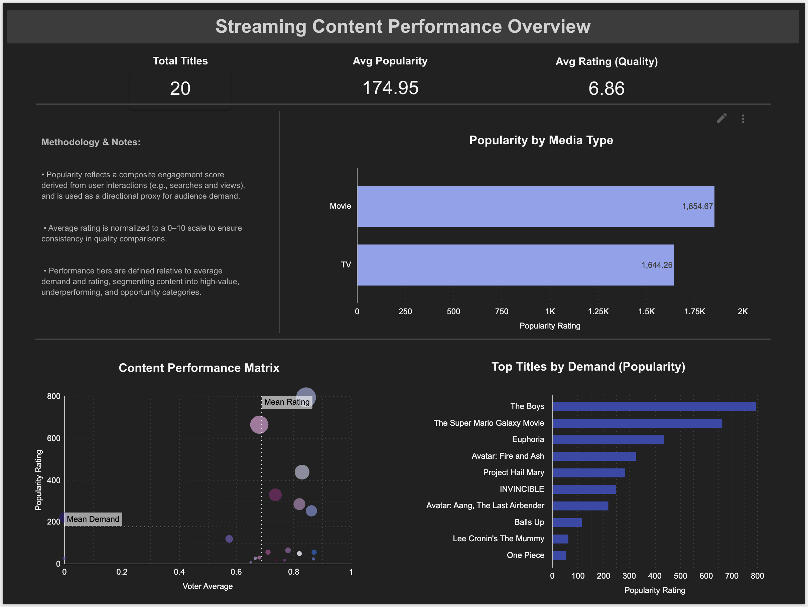

# Streaming Content Performance Analysis

## Project Overview

This project analyzes streaming content performance using engagement (Popularity) and quality (Voter Rating) to evaluate how content performance drives audience demand.

The dataset is sourced from The Movie Database (TMDB) API, providing real-world metadata on movies and TV content.

By comparing demand and quality across titles, the analysis identifies high-value content, underperforming assets, and strategic opportunities for optimization across a streaming portfolio.

## Dashboard & Key Insights

The dashboard below visualizes content performance across demand (Popularity) and quality (Voter Rating), enabling segmentation of titles into strategic performance tiers.

Explore the interactive dashboard: https://datastudio.google.com/reporting/28a0ec12-0a17-40b8-a081-bb1135f0041a

The analysis reveals a clear disconnect between engagement and quality, highlighting both growth opportunities and potential churn risks within the content portfolio.

- Audience demand (Popularity) does not always correlate with content quality, revealing a disconnect between engagement and ratings.
- Several high-quality titles exhibit lower engagement, indicating potential opportunities for improved marketing or content positioning.
- High-demand, lower-rated titles may present churn risk, as engagement is not supported by strong audience satisfaction.
- TV content drives higher aggregate demand compared to movies within this dataset.

## Methodology

- Popularity reflects a composite engagement score derived from user interactions (e.g., searches and views), and is used as a directional proxy for audience demand.
- Voter ratings were normalized to a 0–10 scale to ensure consistency in quality comparisons.
- A content performance matrix was developed to benchmark each title against portfolio averages for demand and quality, enabling segmentation of high-value, underperforming, and opportunity content.
- Content was categorized into four groups: High Demand + High Quality, High Quality + Low Demand, High Demand + Low Quality, and Low Demand + Low Quality.

- ## Tools & Technologies

- Python (data extraction and transformation via TMDB API)
- Google Sheets (data storage)
- Looker Studio (data visualization and dashboarding)
- GitHub (project documentation and version control)

## Business Application

This analysis demonstrates how streaming platforms can evaluate content performance by balancing audience demand and perceived quality.

The framework can be applied to:
- Content acquisition and greenlighting decisions
- Marketing prioritization for underperforming high-quality titles
- Risk identification for high-demand but low-rated content
- Portfolio optimization across content libraries
